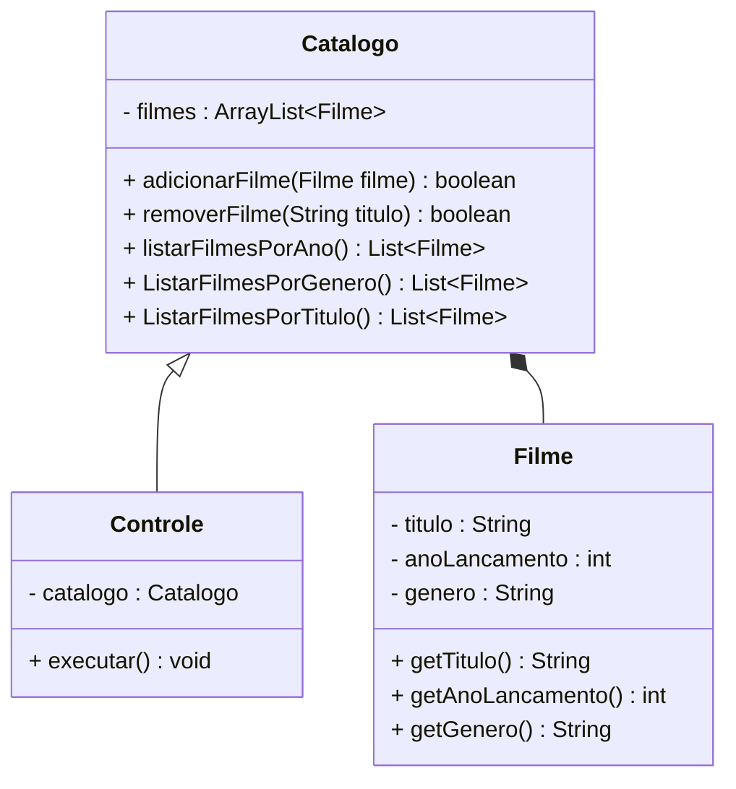

[](https://classroom.github.com/a/glaA5tz-)

# Programação Orientada a Objetos

--- 

Dupla: Leticia Helena do Rosário Furlan e Roberto da Silva Espindola.

## Lista 3: Diagramas de classe

---

### Pacote 1 - Catálogo de filmes

#### Como executar o programa:

- Para rodar o programa basta digitar ```./gradlew run``` no terminal.
- Insira no terminal a opção desejada do menu e aperte ```Enter``` no teclado.
#### Instruções de uso:

- Adicionar filmes: adicione o filme ao catálogo com seu nome, ano de lançamento e genêro.
- Remover filmes: remova o filme desejado inserindo o seu título.
- Listar os filmes: opções que listam os filmes por ordem alfabética de título, de genêro e por ano de lançamento, acionando apenas a sua opção respectiva no menu do programa.
- Buscar os filmes de determinado ano: insira o ano do filme desejado para buscar o filme pelo seu ano de lançamento.


